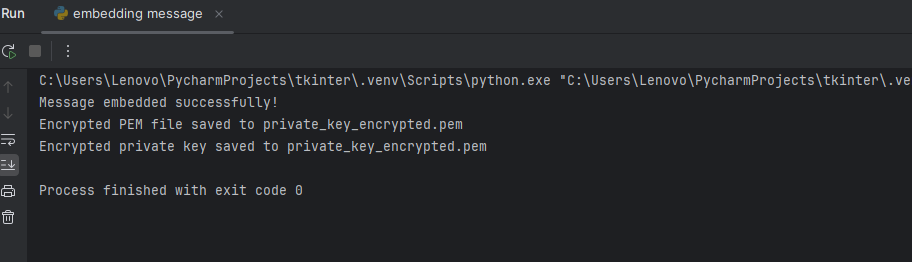
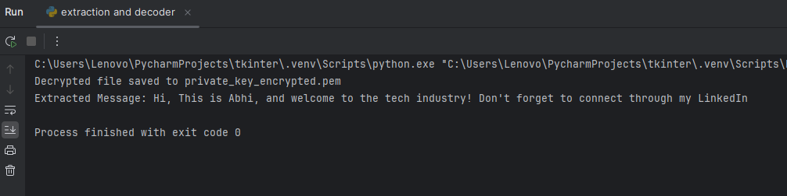
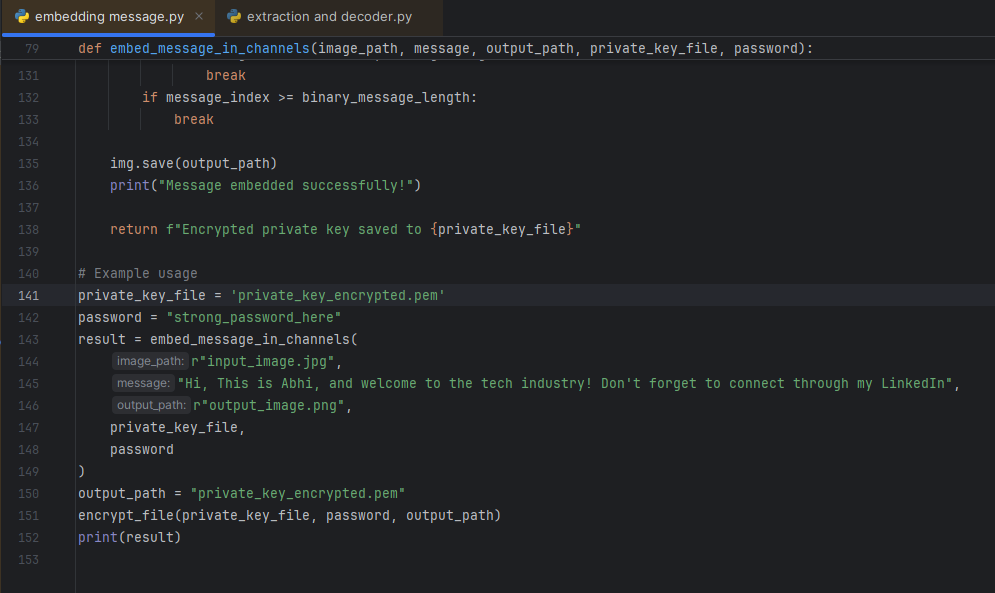
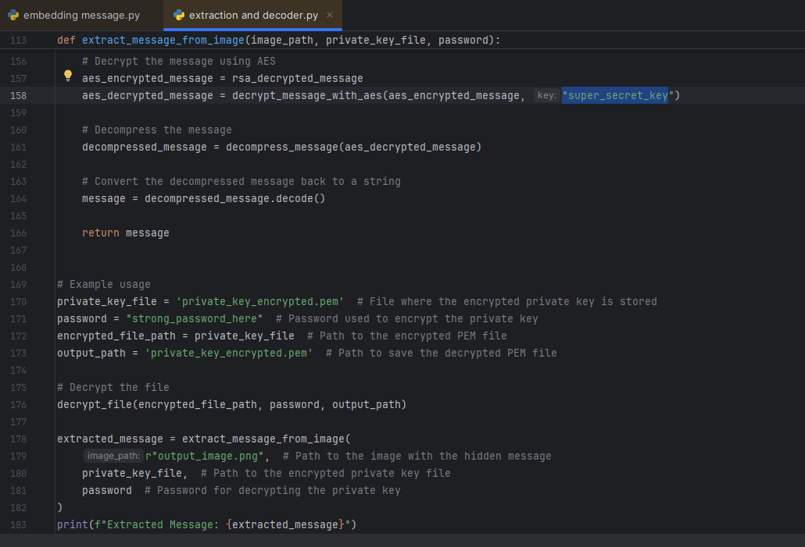

# **Project Name: CIDMessageHunter**

**The Ultimate Advanced Steganography Tool for Secure Hidden Messaging!**


---

### **Introduction**   

Ever wanted to send a secret message that’s so well hidden, no one will know it’s there? **CIDMessageHunter** is here to do just that! This tool lets you hide messages inside images, making them look like regular pictures. Only the intended recipient, armed with the right files and keys, will be able to uncover the hidden message.

---

### **What Is CIDMessageHunter?**

**CIDMessageHunter** is a stealthy, advanced **Steganography** tool inspired by a memorable episode of *CID* (a popular crime show). In this episode, a criminal hides bomb information inside a **pendrive** and stores it behind an image. The only way to decode the information was by using that pendrive. This inspired me to create **CIDMessageHunter**.

**CIDMessageHunter** allows you to: 

- **Embed secret messages** into images, making them look just like regular pictures.
- Only the **authorized recipient**—who has the right decryption keys—will be able to extract and read the hidden message.

---

### **How Does It Work?**

**CIDMessageHunter** uses a multi-layered encryption and decryption system to ensure your hidden message stays private. Here’s how it works:

1. **Embedding the Message**: 
   - Your secret message is encrypted and compressed.
   - It's then hidden within the image’s pixels using advanced **steganography** techniques.
   
2. **Decoding the Message**: 
   - To extract the message, the recipient must have access to multiple secret files and keys:
     - **Private Key File**: The private key is encrypted and stored in a separate file.
     - **Password**: The private key is encrypted with a password for extra security.
     - **Super Key**: A special key is needed to first decrypt the private key before extracting the hidden message.

These layers of protection ensure that even if someone intercepts the image, they won’t be able to get to the secret message without all the right keys.

---

### **Why This Name?**

The name **CIDMessageHunter** comes from a thrilling episode of *CID* where a criminal embeds vital information inside an image. The police need a special pendrive to decode it, and that pendrive hides the crucial key to unlocking the secret message.

I thought, "What if we could create a tool that hides messages in plain sight, just like the criminal did in the show?" So, **CIDMessageHunter** was born! 

Now, I like to think that without the right keys and the file containing the private key, even *CID* would be stumped. It's like playing a high-stakes game of "Who can find the hidden message first?" — and only the right person with all the tools will succeed!

---

### **Features**

- **Advanced Encryption**: AES-GCM encryption for both message and private key ensures top-notch security.
- **Multi-layered Decryption**: Multiple keys (private key, password, and super key) are needed to decode the message, adding extra layers of protection. 
- **Image Steganography**: Hide your message inside an image so it looks like an ordinary picture to anyone else.
- **Compression & Encryption**: Your message is compressed and encrypted, making it harder to detect or decode.
- **Secure Communication**: Ideal for sending confidential messages over untrusted channels while keeping the message hidden in plain sight.

---

### **How to Use CIDMessageHunter?**

#### **1. Embedding a Message**

To embed a message in an image, you’ll need:

- An image file where you’ll hide the message.
- A private key (RSA) and a password for encryption.

Run the embedding script, and **CIDMessageHunter** will encrypt your message, hide it in the image, and save the encrypted private key to a file.

#### **2. Extracting the Message**

To extract the hidden message:

- You need the image that contains the hidden message.
- You need the encrypted private key file.
- You must have the password and the **super key** to decrypt the private key.

After these steps, **CIDMessageHunter** will extract, decrypt, decompress, and reveal the original secret message!

---

### **Requirements**

To run **CIDMessageHunter**, you’ll need:

- Python 3.x
- Required libraries:
    - `pycryptodome`
    - `Pillow`
    - `zlib`
    - `lzma`
    - `base64`
    - `hashlib`

Install the dependencies with the following command:

```bash
pip install -r requirements.txt
```

---

### **Future Enhancements**

While **CIDMessageHunter** is already a powerful tool, there’s always room for improvement:

- **More Image Format Support**: Extend support for additional image types for embedding.
- **Additional Encryption Methods**: Add more encryption algorithms to strengthen security.
- **GUI Integration**: I’m hoping for contributors to help integrate a user-friendly graphical interface (GUI) to make it more accessible to non-technical users.

---

### **Contribute to CIDMessageHunter!**

Got an idea for enhancing **CIDMessageHunter**? Want to help make it even better? You can:

- Fix bugs
- Add features
- Create a **GUI** interface for easier use
- Improve documentation

Feel free to submit a pull request or open an issue if you encounter problems!

---

### **License**

This project is licensed under the MIT License – see the [LICENSE](LICENSE) file for details.

---

### **Get In Touch**

Got questions? Want to talk about hidden messages or steganography? Feel free to reach out or open an issue right here on GitHub. 

---

So there you go! Now, without the right key and file containing that private key, I really don’t think *CID* would be able to get the info. *CIDMessageHunter* makes sure your secrets stay safe—**unless** someone manages to get all the keys and files. 😏
